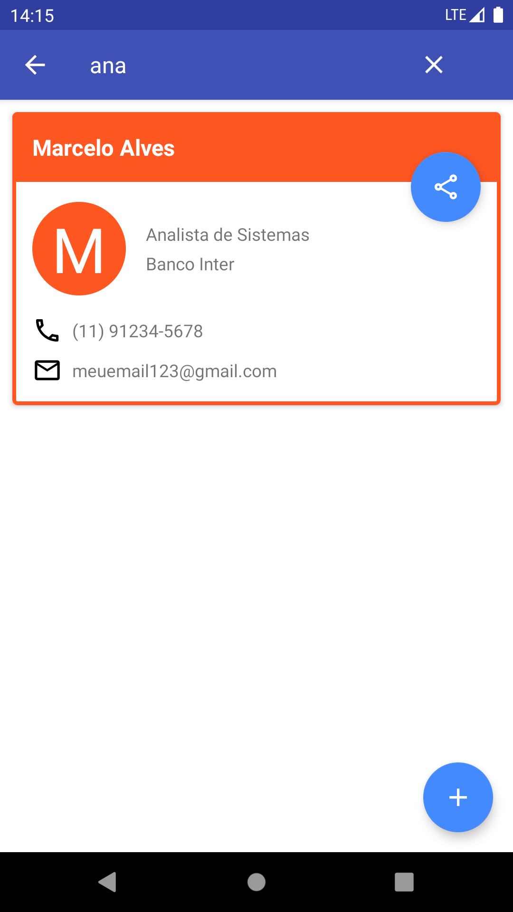
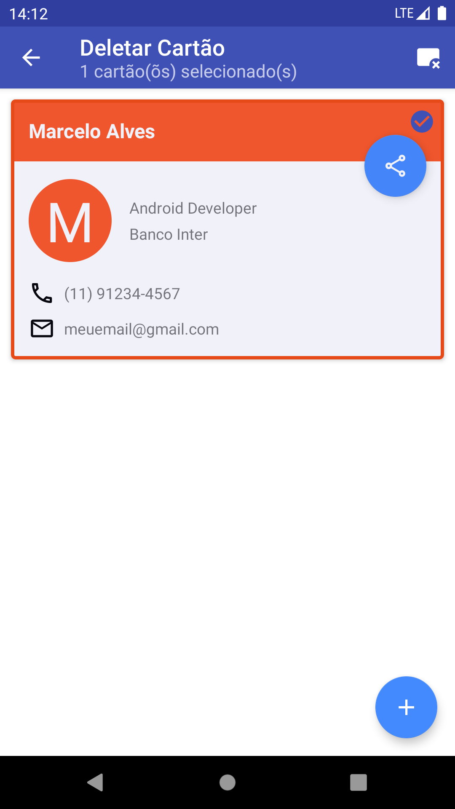

# Cartao-Visita-Dio
> Esse projeto foi proposto no Bootcamping Inter Android Developer. Ele é um projeto de criação e compartilhamento de cartões de visita. O projeto utiliza os seguintes itens: Injeção de dependência com Koin &amp; Dagger Hilt, Banco de Dados com Room, e Jetpack Navigation.

#### Branches

Esse projeto está dividido em duas branches:

- [Cartao-Visita-Dio com Koin](https://github.com/marceloalves95/Cartao-Visita-Dio/tree/Cartao-Visita-Dio-Koin)
- [Cartao-Visita-Dio com DaggerHilt](https://github.com/marceloalves95/ToDoList-Dio/tree/ToDoListDio-DaggerHilt)

Para mais detalhes sobre a implementação de cada injeção de dependência, escolha a branch acima ou digite o código abaixo para baixar a branch especifica:

```
//Branch Cartao-Visita-Dio-Koin
git clone https://github.com/marceloalves95/Cartao-Visita-Dio.git --branch Cartao-Visita-Dio-Koin
//Branch Cartao-Visita-Dio-DaggerHilter
git clone https://github.com/marceloalves95/Cartao-Visita-Dio.git --branch Cartao-Visita-Dio-DaggerHilt
```

#### Instalação com o Koin

##### Dependências

Para o uso do Navigation, Room e o Koin, inclua o seguinte código no `build.gradle` do projeto e atualize o `Gradle`:

```groovy
buildscript {

    ext{
        //Room Version
        room_version="2.3.0"
        //Koin Version
        koin_version="3.1.1"
        //........
    }
    dependencies{
    .......
        classpath "androidx.navigation:navigation-safe-args-gradle-plugin:$nav_version"
       
    }
    .......
}
```

Inclua as seguintes dependências adicionando o código no `build.gradle` do módulo do projeto e atualize o `Gradle`:

```groovy
plugins {
    id 'kotlin-kapt'
    id 'kotlin-parcelize'
    //Navigation Safe Args
    id "androidx.navigation.safeargs.kotlin"
    ........
}
dependencies {
    //Navigation
    implementation "androidx.navigation:navigation-fragment-ktx:$navigation_version"
    implementation "androidx.navigation:navigation-ui-ktx:$navigation_version"
    //Room
    kapt "androidx.room:room-compiler:$room_version"
    implementation "androidx.room:room-runtime:$room_version"
    implementation "androidx.room:room-ktx:$room_version"
    //Koin
    implementation "io.insert-koin:koin-android:$koin_version"
    testImplementation "io.insert-koin:koin-test:$koin_version"
    ..........
}
```

##### Aplicação

Crie uma classe chamado `Application`:

```kotlin
class Application:Application() {

    override fun onCreate() {
        super.onCreate()
        startKoin {
            androidContext(this@Application)
            modules(appModules)
        }

    }
}
```

##### AndroidManifest

Acrescente na linha no `AndroidManifest.xml`

```xml
<uses-permission android:name="android.permission.READ_EXTERNAL_STORAGE" />
<uses-permission android:name="android.permission.WRITE_EXTERNAL_STORAGE" tools:ignore="ScopedStorage" />

<application
        android:name=".di.Application"
        //Seu tema
        android:theme="@style/Theme.MeuTema">
  <activity
            android:name=".ui.main.MainActivity"
            android:theme="@style/Theme.MeuTema.NoActionBar">
       .....
</application>
```

##### Módulo

Crie um arquivo `AppModules.kt`:

```kotlin
val appModules = module {
    single {
        Room.databaseBuilder(
            get(),
            //Aqui você define a classe do seu banco de dados
            AppDatabase::class.java,
            //Nome do seu banco
            BD_NAME
        ).fallbackToDestructiveMigration()
            .build()
    }
    single{
        //Módulo da interface do banco
        get<AppDatabase>().visitaDao()
    }
    single {
        //Repository
        VisitaRepository(get())
    }
    viewModel {
        //View Model
        CartaoVisitaViewModel(get())
    }

}
```

##### Tabelas

Crie a tabela do seu banco:

```kotlin
@Entity(tableName = "visita")
data class Visita(
    @PrimaryKey(autoGenerate = true)
    val id:Int,
    val nome:String,
    val cargo:String,
    val empresa:String,
    val telefone:String,
    val email:String,
    val cor: String,
    var selected: Boolean
)
```

##### DAO

Crie uma interface para o `Dao` do projeto:

```kotlin
@Dao
interface VisitaDao {
    @Insert(onConflict = OnConflictStrategy.REPLACE)
    suspend fun insert(visita: Visita)
    @Update
    suspend fun update(visita: Visita)
    @Query("SELECT * FROM visita")
    suspend fun all():MutableList<Visita>
    @Query("DELETE FROM visita WHERE id IN (:id)")
    suspend fun deleteAll(id:MutableList<Int>)
}
```

##### Repository

Crie uma classe `Repository`

```kotlin
class VisitaRepository(private val visitaDao: VisitaDao) {

    suspend fun insert(visita: Visita) = visitaDao.insert(visita)
    suspend fun update(visita: Visita) = visitaDao.update(visita)
    suspend fun all():MutableList<Visita> = visitaDao.all()
    suspend fun deleteAll(id:MutableList<Int>) = visitaDao.deleteAll(id)

}
```

##### ViewModel

Crie a `ViewModel` do seu projeto:

```kotlin
class CartaoVisitaViewModel(private val repository: VisitaRepository):ViewModel(){

    val listAll = MutableLiveData<MutableList<Visita>>()

    fun adicionarCartao(visita: Visita){
        viewModelScope.launch {
            repository.insert(visita)
        }
    }
    fun atualizarCartao(visita: Visita){
        viewModelScope.launch {
            repository.update(visita)
        }
    }
    fun listarCartoes(){
        viewModelScope.launch {
            listAll.value = repository.all()
        }
    }
    fun deleteAll(id:MutableList<Int>){
        viewModelScope.launch {
            repository.deleteAll(id)
        }
    }

}
```

#### Instalação com o DaggerHilt

#### Dependência

Paras o uso do Navigation, Room e o DaggerHilt, inclua o seguinte código no `build.gradle` do projeto e atualize o `Gradle`:

```groovy
buildscript {

    ext{
        //Room Version
        room_version="2.3.0"
        //DaggerHilt Version
        hiltVersion = '2.37'
        ........
    }
   
}
.......
```

Inclua as seguintes dependências adicionando o código no `build.gradle` do módulo do projeto e atualize o `Gradle`:

```groovy
plugins {
    //Navigation Safe Args
    id "androidx.navigation.safeargs.kotlin"
    //DaggerHilt
    id 'dagger.hilt.android.plugin'
    ........
}
dependencies {
    //Navigation
    implementation "androidx.navigation:navigation-fragment-ktx:$navigation_version"
    implementation "androidx.navigation:navigation-ui-ktx:$navigation_version"
    //Room
    kapt "androidx.room:room-compiler:$room_version"
    implementation "androidx.room:room-runtime:$room_version"
    implementation "androidx.room:room-ktx:$room_version"
    //Dagger Hilt
    kapt "com.google.dagger:hilt-compiler:$hiltVersion"
    implementation "com.google.dagger:hilt-android:$hiltVersion"
    annotationProcessor "com.google.dagger:hilt-compiler:$hiltVersion"
    //Testes Room & DaggerHilt
    testImplementation "androidx.room:room-testing:$room_version"
    testImplementation "com.google.dagger:hilt-android-testing:$hiltVersion"
    androidTestImplementation "com.google.dagger:hilt-android-testing:$hiltVersion"
    androidTestAnnotationProcessor "com.google.dagger:hilt-compiler:2.37"
    testAnnotationProcessor "com.google.dagger:hilt-compiler:$hiltVersion"
    ..........
}
```

##### Aplicação

Crie uma classe chamado `Application`:

```kotlin
@HiltAndroidApp
class Application:Application()
```

##### AndroidManifest

Acrescente na linha no `AndroidManifest.xml`

```xml
<application
        android:name="seupacote.di.Application"
        //Seu tema
        android:theme="@style/Theme.MeuTema">
       .....
</application>
```

##### Módulo

Crie um módulo com uma classe Singleton chamado `DatabaseModule`:

```kotlin
@InstallIn(SingletonComponent::class)
@Module
object DatabaseModule {

    @Singleton
    @Provides
    fun provideAppDatabase(@ApplicationContext context: Context): AppDatabase =
        Room.databaseBuilder(context, AppDatabase::class.java, BD_NAME).fallbackToDestructiveMigration().build()


    @Provides
    fun provideTarefaDao(appDatabase: AppDatabase): TarefaDao{
        return appDatabase.tarefaDao()
    }
    
    .......

}
```

##### Tabelas

Crie a tabela do seu banco:

```kotlin
@Entity(tableName = "tarefa")
data class Tarefa(
    @PrimaryKey(autoGenerate = true)
    val id: Int,
    val titulo: String,
    val descricao: String,
    val horario: String,
    val data: String,
    val cor: String,
    val nomeCor: String,
    val status:String,
    var selected: Boolean
)
```

##### DAO

Crie uma interface para o `Dao` do projeto:

```kotlin
@Dao
interface TarefaDao {
    @Insert(onConflict = OnConflictStrategy.REPLACE)
    suspend fun insert(tarefa: Tarefa)
    @Update
    suspend fun update(tarefa: Tarefa)
    @Query("SELECT * FROM tarefa")
    suspend fun allTarefas():MutableList<Tarefa>
    @Query("DELETE FROM tarefa WHERE id IN (:id)")
    suspend fun deleteAll(id:MutableList<Int>)
}
```

##### Repository

Crie uma classe `Repository`

```kotlin
@Singleton
class TarefaRepository @Inject constructor(private val tarefaDao: TarefaDao) {

    suspend fun insert(tarefa: Tarefa) = tarefaDao.insert(tarefa)
    suspend fun update(tarefa: Tarefa) = tarefaDao.update(tarefa)
    suspend fun allTarefas():MutableList<Tarefa> = tarefaDao.allTarefas()
    suspend fun deleteAll(id:MutableList<Int>) = tarefaDao.deleteAll(id)
}
```

##### ViewModel

Crie a `ViewModel` do seu projeto:

```kotlin
@HiltViewModel
class TarefaViewModel @Inject constructor(private val repository: TarefaRepository):ViewModel(){

    val listAll = MutableLiveData<MutableList<Tarefa>>()

    fun adicionarTarefas(tarefa: Tarefa){
        viewModelScope.launch {
            repository.insert(tarefa)
        }
    }
    fun atualizarTarefas(tarefa: Tarefa){
        viewModelScope.launch {
            repository.update(tarefa)
        }
    }
    fun listarTarefas(){
        viewModelScope.launch {
            listAll.value = repository.allTarefas()
        }
    }
    fun deleteAll(id:MutableList<Int>){
        viewModelScope.launch {
            repository.deleteAll(id)
        }
    }
}
```

##### AndroidEntryPoint

Para cada Activity ou Fragment do seu projeto adicione a seguinte linha antes do seu arquivo

```kotlin
@AndroidEntryPoint
class MainActivit{
.....
}
```

#### Telas do Aplicativo

|                       |                        |
| :------------------------: | --------------------------- |
| Tela inicial do aplicativo | Tela de pesquisa dos cartões           |
|                       |                        |
| Tela de criação dos cartões de visita  | Tela de alteração dos cartões de visita |
|                       |                        |
| Tela de remoção dos cartões de visita  | Tela com a imagem do cartão |


